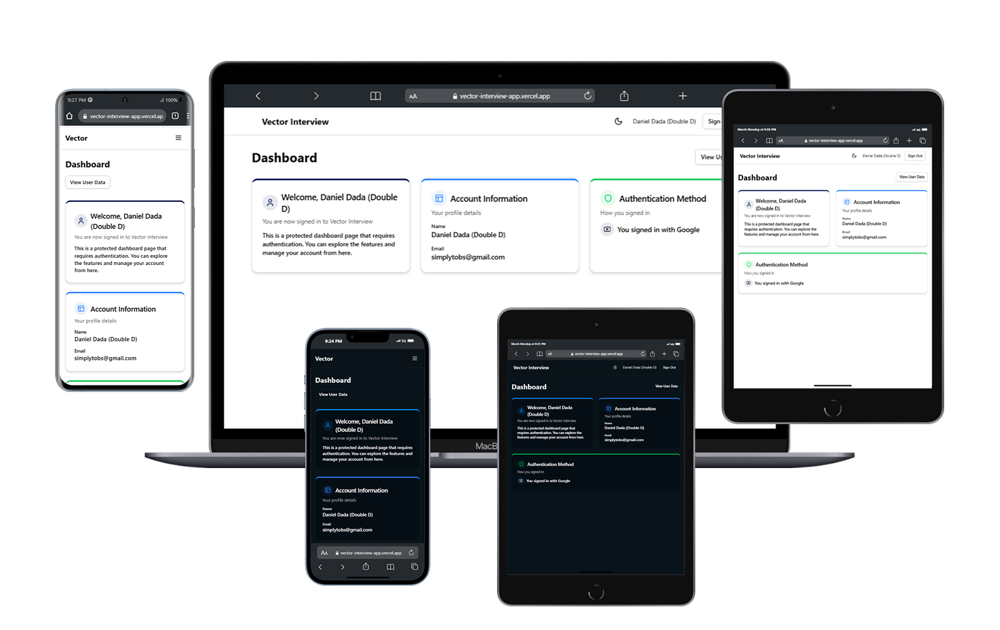

# Vector Interview - Frontend Authentication System

A modern authentication system built with Next.js, NextAuth.js, and Tailwind CSS for Vector Interview.



## 🚀 Features

- **Google OAuth Authentication**: Sign in with Google accounts
- **Email/Password Authentication**: Traditional login with form validation
- **Responsive Design**: Mobile-first approach for all screen sizes
- **Dark/Light Mode**: Theme toggle with system preference detection
- **Form Validation**: Client-side validation using Yup and React Hook Form
- **Protected Routes**: Middleware-based route protection
- **Modern UI**: Built with Tailwind CSS and ShadCN components

## 📋 Prerequisites

- Node.js 18.x or later
- npm or yarn

## 🛠️ Installation

1. Clone the repository:

```bash
git clone https://github.com/Daniel-T-Dada/vector-interview-app.git
cd vector-interview-app
```

2. Install dependencies:

```bash
npm install
# or
yarn install
```

3. Set up environment variables:

Create a `.env.local` file in the root directory with the following variables:

```
# NextAuth.js Configuration
NEXTAUTH_URL=http://localhost:3000
NEXTAUTH_SECRET=your-secret-key-change-in-production

# Google OAuth
GOOGLE_CLIENT_ID=your-google-client-id
GOOGLE_CLIENT_SECRET=your-google-client-secret
```

To get Google OAuth credentials:

1. Go to the [Google Cloud Console](https://console.cloud.google.com/)
2. Create a new project
3. Navigate to "APIs & Services" > "Credentials"
4. Create an OAuth 2.0 Client ID
5. Add `http://localhost:3000/api/auth/callback/google` as an authorized redirect URI

## 🚀 Running the Application

```bash
npm run dev
# or
yarn dev
```

The application will be available at [http://localhost:3000](http://localhost:3000).

## 📁 Project Structure

```
/vector-interview
│── public/               # Static assets
│── app/                  # Next.js App Router
│   ├── layout.jsx        # Root layout (includes providers)
│   ├── page.jsx          # Homepage (redirects to login)
│   ├── auth/             # Authentication pages
│   │   ├── login/        # Login page
│   │   │   ├── page.jsx
│   │   ├── signup/       # Signup page with validation
│   │   │   ├── page.jsx
│   │   ├── dashboard/    # Protected dashboard page
│   │   │   ├── page.jsx
│   │   ├── api/          # API routes
│   │   │   ├── auth/
│   │   │   │   ├── [...nextauth]/route.js  # NextAuth.js API route
│── components/           # Reusable UI components
│   ├── ui/               # ShadCN UI components
│   │   ├── button.jsx    # Button component
│   │   ├── card.jsx      # Card component
│   │   ├── input.jsx     # Input component
│   │   ├── label.jsx     # Label component
│   │   ├── alert.jsx     # Alert component
│   │   ├── spinner.jsx   # Loading spinner component
│   ├── Navbar.jsx        # Navigation bar
│   ├── theme-provider.jsx # Theme provider for dark/light mode
│   ├── auth-provider.jsx  # Authentication provider
│── lib/                  # Utility functions
│   ├── utils.js          # Helper functions
│── middleware.js         # NextAuth.js middleware for route protection
│── tailwind.config.js    # Tailwind CSS configuration
```

## 🔒 Authentication Flow

1. **Google OAuth**:

   - User clicks "Sign in with Google"
   - Redirected to Google consent screen
   - After approval, redirected back to the application
   - NextAuth.js creates a session

2. **Email/Password**:
   - User enters email and password
   - Client-side validation with Yup
   - Credentials are verified against the mock database
   - If valid, NextAuth.js creates a session

## 👤 Mock Users

For demonstration purposes, the application comes with pre-configured mock users:

| Name      | Email               | Password    |
| --------- | ------------------- | ----------- |
| Demo User | user@example.com    | password123 |
| Double D  | double_d@vector.com | password123 |

You can use these credentials to log in and test the application without creating a new account.

The mock user data is stored in-memory and is defined in `lib/users.js`. In a production environment, you would replace this with a proper database connection.

## 🎨 UI Components

The project uses a combination of custom components and ShadCN UI components:

- **Button**: Primary, secondary, outline, and ghost variants
- **Card**: For login and signup forms
- **Input**: Form input fields with validation
- **Alert**: For success and error messages
- **Spinner**: Loading indicators
- **Navbar**: Responsive navigation with mobile menu

## 🔐 Route Protection

Protected routes are implemented using NextAuth.js middleware:

- `/auth/*` routes are accessible only to unauthenticated users
- `/dashboard/*` routes are accessible only to authenticated users
- Authenticated users are redirected to the dashboard when trying to access auth pages
- Unauthenticated users are redirected to the login page when trying to access protected pages

## 🌙 Dark/Light Mode

The application supports dark and light modes:

- Automatic detection of system preference
- Manual toggle via the theme toggle button
- Theme persistence using localStorage

## 📱 Responsive Design

The UI is fully responsive across all device sizes:

- Mobile-first approach
- Responsive navigation with hamburger menu on small screens
- Optimized layouts for different screen sizes
- Accessible on touch devices

## 🧪 Future Improvements

- Add email verification
- Implement password reset functionality
- Add social login providers (GitHub, Twitter, etc.)
- Connect to a real database for user management
- Add user profile management
- Implement role-based access control

## 📄 License

This project is licensed under the MIT License - see the LICENSE file for details.

## 🙏 Acknowledgements

- [Next.js](https://nextjs.org/)
- [NextAuth.js](https://next-auth.js.org/)
- [Tailwind CSS](https://tailwindcss.com/)
- [ShadCN UI](https://ui.shadcn.com/)
- [React Hook Form](https://react-hook-form.com/)
- [Yup](https://github.com/jquense/yup)
